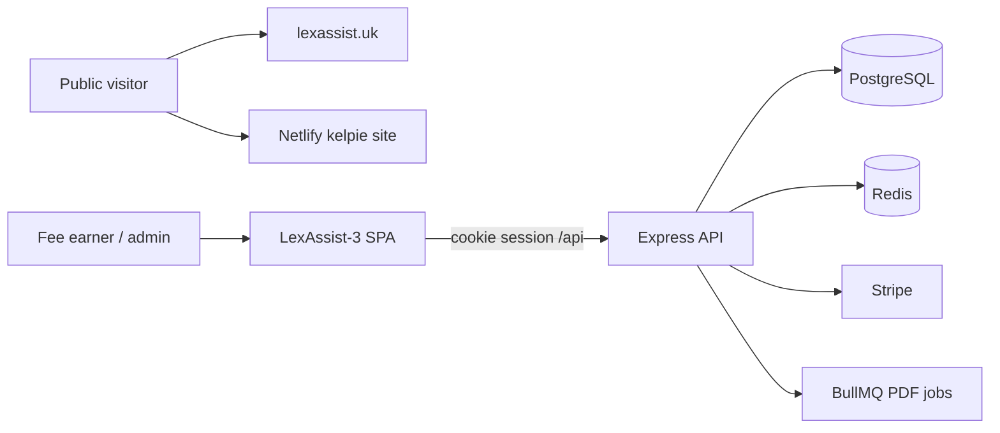
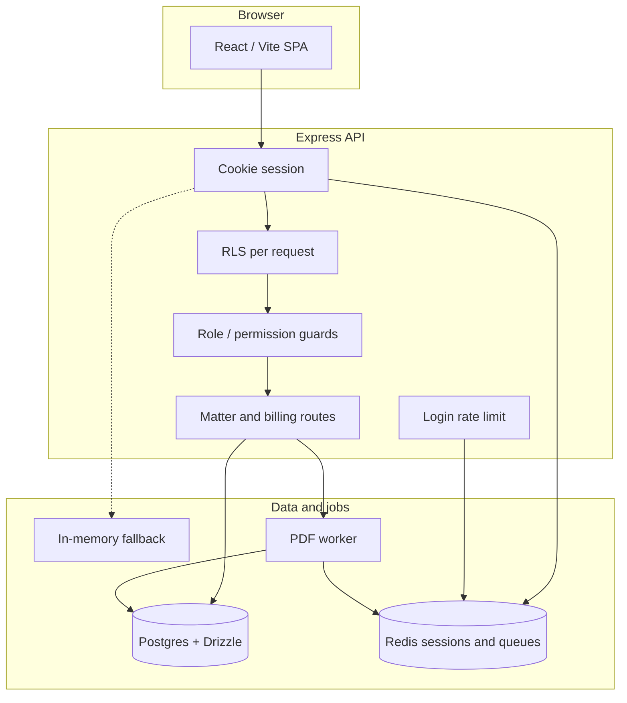
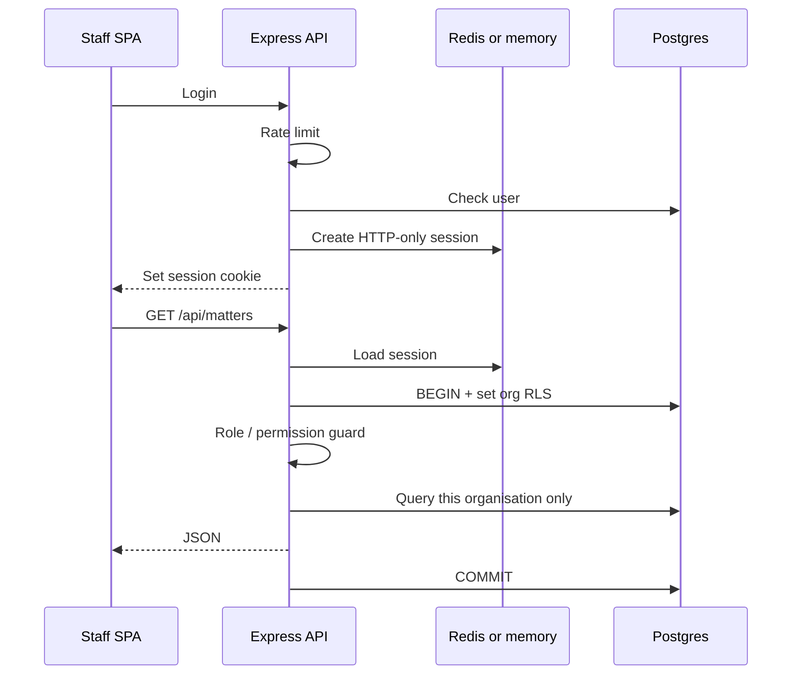
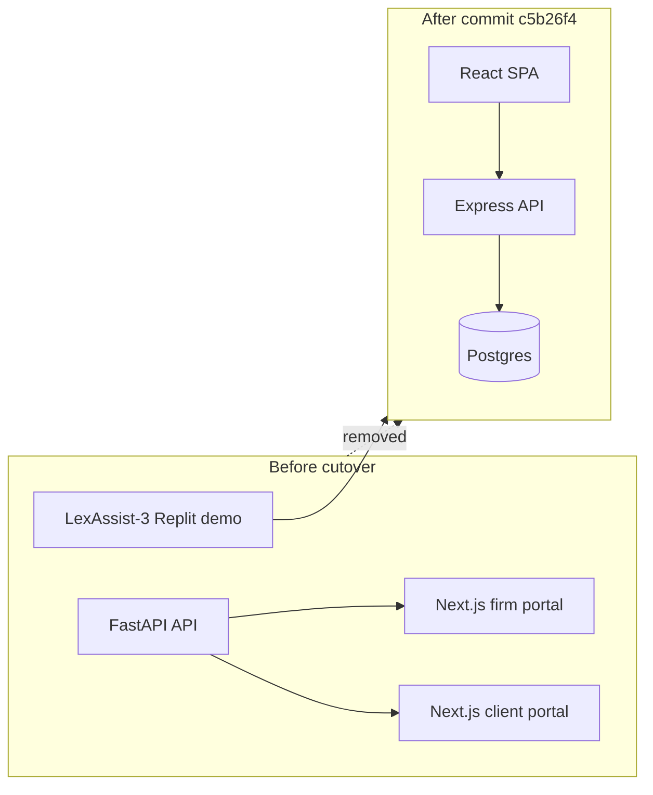
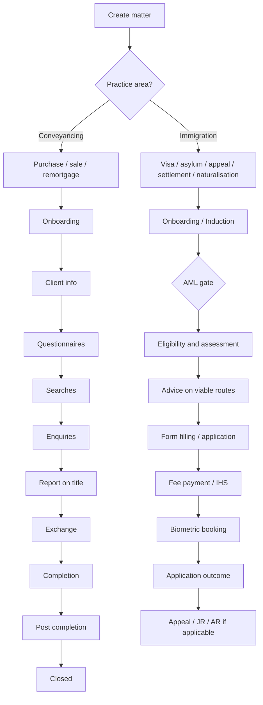
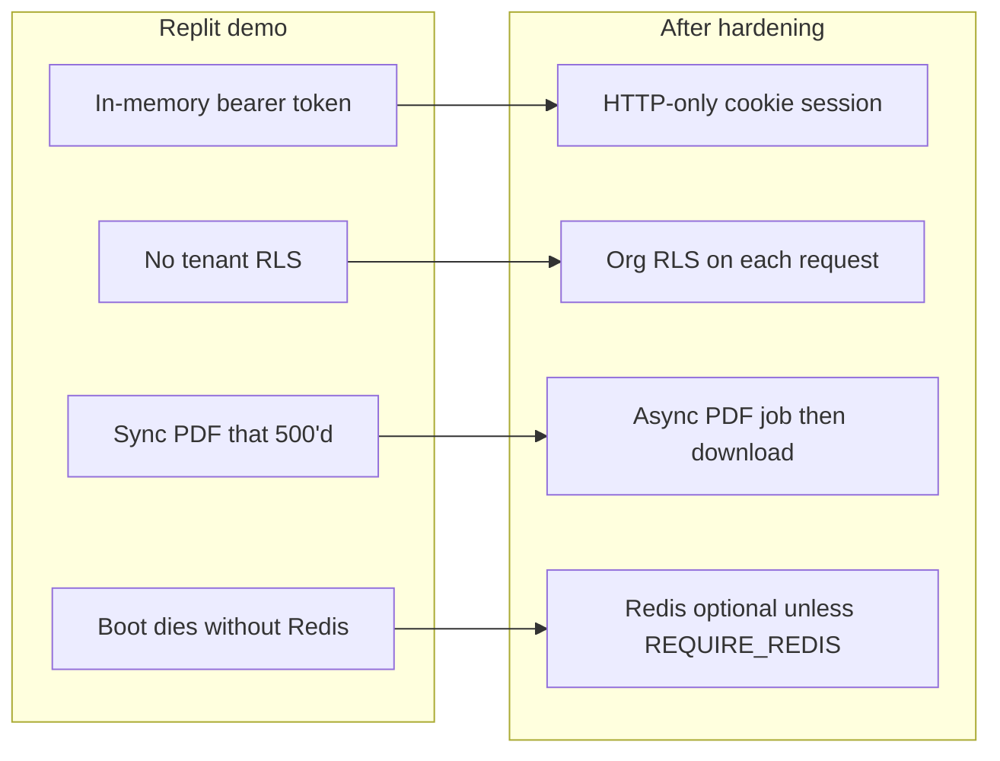
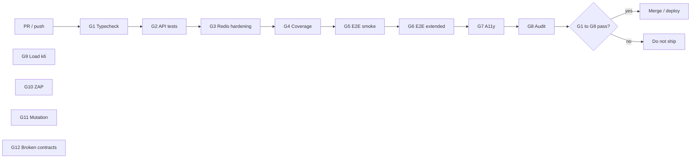
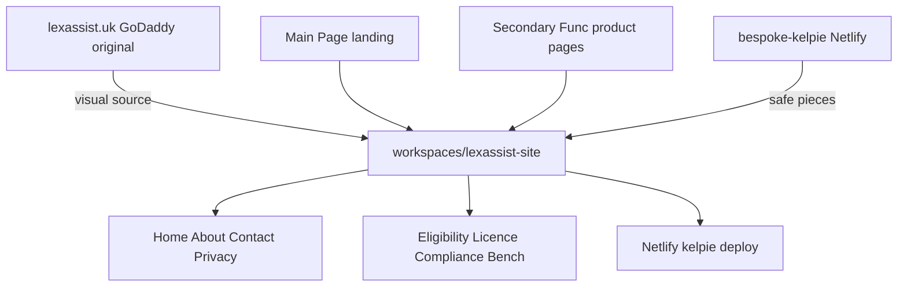
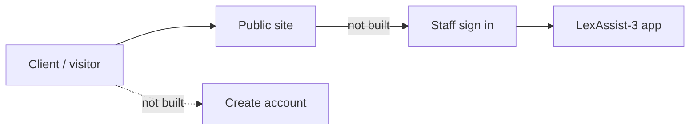

# LexAssist-3 Contribution Report

**Prepared by:** Ally Abdullah Zafar  
**Period covered:** 7–17 September 2026  
**Date:** 18 September 2026  
**Branch:** `hardening/lexassist-3`

---

## Purpose of this report

LexAssist is a UK legal practice product. The idea, the brand, and a working demo already existed. My job was not to invent the product or sell it. My job was to take what was already there and make it shippable: a practice app that could be deployed with real controls, and a public website that matched the live brand.

This report splits those two things clearly. First, what was already built. Second, what I contributed.

---

## Architecture at a glance

LexAssist now has two surfaces that must not be confused. The public site is the brand. The practice app is the product staff use for matters.

The Netlify site is the rebuild I shipped. lexassist.uk remains the live GoDaddy original. They are not wired together yet. Staff login on the marketing site is also not wired into the app.

### Practice app after hardening

Solid lines are the production path. Dotted lines are the fallback I added so a deploy without Redis does not crash-loop. Once Redis is provisioned, `REQUIRE_REDIS=1` should be set and the fallback should not be used in production.

### What a staff request does now

The Replit demo authenticated with an in-memory bearer token. After the hardening work, a typical API call follows this path:

---

## What was already built

### The brand and the live website

[lexassist.uk](https://lexassist.uk/) was already live. It had been built in GoDaddy’s website builder. It carried the brand, the copy, the colours, and the public pages: Home, About Us, Contact Us, Privacy Policy, and the service pages for eligibility, sponsor licence, compliance, and LexAssist Bench.

That site was the visual source of truth. It was not in this codebase as a maintainable set of files.

### The practice application (LexAssist-3)

LexAssist-3 already existed as a Replit full-stack demo before I started this phase. It was a conveyancing and immigration practice tool, not a blank project.

**Stack that was already in place**

- React + Vite frontend
- Express API
- PostgreSQL with Drizzle ORM
- pnpm workspace
- AI hooks (enquiry generation, email drafting, document analysis)
- Docker files aimed at a Render cutover

**Practice features that were already in place**

- Organisation, users, roles, and department views (conveyancing, immigration, or both)
- Matters for purchase, sale, remortgage, visa, asylum, appeal, settlement, and naturalisation
- Tasks, reminders, journal, time entries, documents, and financials
- Enquiry packs, compliance rule templates, risk assessments
- An immigration assessment tool and an immigration manual
- Seed organisation (Gardner Champion) and demo users, including `admin` / `admin12`

That demo was built for a local / Replit environment. Auth was an in-memory bearer token. Redis was not a first-class session store. There was no production QA gate. Several workflows looked complete in the UI and failed when exercised end to end.

### An earlier prototype that we retired

This repository also held an older LexAssist MVP: a FastAPI API plus Next.js firm and client portals. That stack had been prepared for Render and Netlify. It was not the product we were going to ship. On 8 September I confirmed with the work that LexAssist-3 was the only app going forward, and the old MVP was removed in the cutover commit.

---

## My role

I was the person responsible for making the existing product shippable.

That meant:

- Sitting with the stakeholder and turning immigration process into a real workflow in the app
- Finding what was broken in the demo and fixing it
- Putting production controls around sessions, tenants, billing, and jobs
- Replacing “it runs on my machine” with a test suite and CI gates
- Rebuilding the public site from the GoDaddy original so we could own, match, and deploy it
- Deciding what not to build yet (public sign-in, a full CRM tab, a full GDPR programme)

I did not originate the legal-tech idea, the brand, or the first working demo. I took those as given and made them into something we could deploy, test, and iterate on.

---

## What I contributed

### 1. Immigration workflow, with the stakeholder in the room

The demo already listed immigration matter types. The stages were a generic intake-to-closed path, and they sat in the same conveyancing-shaped flow.

I specified and shipped a separate immigration workflow on the same Matters screen:

- User picks practice area (conveyancing or immigration) before seeing matter types
- Demo-active types stay visible; the schema allows more types later without a rewrite
- Shared immigration stage spine:
  1. Onboarding / Induction
  2. Eligibility and Assessment
  3. Advice on Viable Routes
  4. Form Filling / Application
  5. Fee Payment / IHS
  6. Biometric Booking
  7. Application Outcome
  8. Appeal / JR / AR (if applicable)
- AML gate during induction

That was a product decision, not a cosmetic change. Conveyancing stayed. Immigration stopped pretending to be property work.

Both paths stay on the same Matters screen. The sidebar, types, and stages filter on the user's department: conveyancing, immigration, or both.

### 2. Production hardening of the API

I took the Replit demo’s server and put deployment controls under version control:

- HTTP-only cookie sessions, with Redis when available and in-memory fallback when it is not
- Per-request Postgres row-level security so one organisation cannot read another’s data
- Role and permission guards
- Login rate limiting
- Stripe billing webhooks
- Background PDF export jobs (BullMQ)

Two defects showed up only because we started testing for real:

1. **PDF export was broken.** The renderer closed the document before writing content. Every journal and matter PDF returned HTTP 500. I had that fixed and verified both endpoints return a valid PDF.
2. **Redis would crash a production boot.** The process exited if Redis was missing. A deploy without Redis provisioned would loop. I changed that so Redis is required only when `REQUIRE_REDIS=1` is set. CI still requires Redis. A single-instance deploy can start without it, with the explicit caveat that in-memory sessions die on restart.

### 3. Quality gates instead of a demo checklist

I added a test suite and a written QA matrix (`LexAssist-3/docs/QA_MATRIX.md`).

At cutover: **28 test files, 89 passing, 1 expected fail.**

Gates now in the repo:

| Gate | What it covers |
|------|----------------|
| G1 | Typecheck |
| G2 | API tests |
| G3 | Hardening with Redis |
| G4 | Coverage |
| G5–G6 | Playwright smoke and extended e2e |
| G7 | Accessibility (axe) |
| G8 | Dependency audit |
| G9–G11 | Load (k6), ZAP security, mutation testing (scheduled / manual) |
| G12 | Known broken contracts, tracked rather than hidden |

GitHub Actions runs the merge-blocking gates. Known remaining issues are written down in `LexAssist-3/tests/BROKEN_WORKFLOWS.md` instead of being forgotten: reminder completion returns a stale object; immigration AI still calls Anthropic from the browser; immigration matters skip compliance seeding.

G9 to G12 are scheduled, manual, or report-only. They exist so we do not pretend unknown risk is zero.

I also had Graphify run over the codebase so later work could follow real dependencies rather than guess.

### 4. Cutover: LexAssist-3 is the product

On 11 September I cut the repository over to LexAssist-3 (`c5b26f4`).

That commit:

- Replaced the legacy FastAPI / Next.js monorepo with the Express + React app
- Brought the hardening work into git
- Added the QA workflows
- Left a single product surface: `LexAssist-3/`

The branch is `hardening/lexassist-3`. That is the committed app state.

### 5. Public website: from GoDaddy pages to a site we can ship

The live site was not something we could edit in this repo. I merged the Main Page landing chrome with the Secondary Func product pages into `workspaces/lexassist-site/`.

Then I matched it to lexassist.uk rather than leaving a “close enough” rebuild:

- Colours sampled from the live site (primary green, cream, paper, footer)
- Karla and Old Standard TT, later self-hosted so the headline does not flash a fallback font
- Home, About, Contact, and Privacy brought in line with the original layout
- Services dropdown hover gap fixed so the menu can be used
- Contact map and Get Directions, placed as on the original
- About ticker made infinite
- Motion added with Anime.js
- Em dashes removed from copy
- Safe pieces taken from the existing Netlify kelpie deploy
- Mobile logo reduced and centred; desktop logo remains centred in the header

The site was deployed to `https://bespoke-kelpie-a4f21a.netlify.app/`.

Pages now in the merged site: Home, About, Contact, Privacy, Eligibility Check, Apply for a Sponsor Licence, Sponsor Compliance, LexAssist Bench.

This website work is on disk and on Netlify. It is **not yet committed** to git.

### 6. What I scoped and deliberately did not ship

Part of making something shippable is refusing unfinished surface area.

| Topic | What I did | What I did not do |
|-------|------------|-------------------|
| UK GDPR | Scoped lawful basis, DPIA, retention, DSR, cookies, encryption; assessed current gaps | Did not implement a full compliance programme |
| Public accounts | Confirmed staff login should eventually wire to the LexAssist-3 app; looked at GDPR-safe account creation | Did not add Sign in / Create account on the marketing site |
| Clients CRM | Described what a Clients tab would be if matters stopped being the only client record | Did not build it |
| Load on live | Added a k6 gate so traffic can be simulated | Did not run a signed-off live load test |

Those are parked with a clear next step, not half-built in production.

---

## Evidence

| Item | Where it lives |
|------|----------------|
| LexAssist-3 added to the repo | Commit `b7daf8f` (7 Sep 2026) |
| Cutover + hardening + tests | Commit `c5b26f4` (11 Sep 2026) |
| QA matrix | `LexAssist-3/docs/QA_MATRIX.md` |
| Known broken workflows | `LexAssist-3/tests/BROKEN_WORKFLOWS.md` |
| Merged public site | `workspaces/lexassist-site/` (uncommitted) |
| Public site deploy | `https://bespoke-kelpie-a4f21a.netlify.app/` |
| Live brand reference | `https://lexassist.uk/` |

---

## Current status

**Practice app.** LexAssist-3 is the product. It is committed, hardened, and covered by a test matrix. It is past “Replit demo” and not yet a fully signed-off production estate (Redis should be required once provisioned; GDPR programme and a few tracked defects remain).

**Public site.** We now have a maintainable HTML/CSS/JS site that matches the live brand and is deployed on Netlify. It still needs to be committed, and public account creation is intentionally not on it.

**My contribution in one sentence.** I did not build LexAssist from nothing. I took a working demo and a GoDaddy website and turned them into a deployable practice app with real controls, a written quality bar, an immigration workflow that matches how the firm actually works, and a public site we can own.

---

## Suggested next steps

1. Commit `workspaces/lexassist-site/` so the public site is not only on disk and Netlify.
2. Provision Redis and set `REQUIRE_REDIS=1` on the hosted API.
3. Close the tracked defects in `BROKEN_WORKFLOWS.md`, starting with PDF-adjacent reminder state and immigration compliance seeding.
4. Decide whether public accounts belong on the marketing site at all, or only as a staff link into the app.
5. If the firm wants a Clients CRM tab, treat that as a new piece of product work, not a leftover from this phase.

The intended later shape, which is **not built**, is a staff link from the public site into the app rather than a second account system on Netlify:

