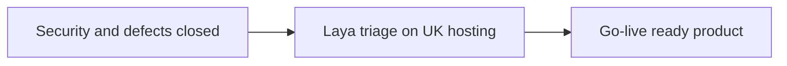

# LexAssist-3 — Contribution & Forward Plan

**Prepared by:** Ally Abdullah Zafar  
**Date:** 21 September 2026  
**Audience:** Stakeholders  

---

## Purpose

What we have done to LexAssist-3, why it mattered, and how we plan to move forward — especially the Laya decision layer that remains before go-live. Security hardening and known broken workflows are closed in code (see `docs/LexAssist-Ship-Status-Report.md`) and are not open product blockers in this note.

---

## What we contributed to LexAssist-3

### 1. Immigration that matches how the firm works

**What:** A separate immigration path on the same Matters screen — practice area first, then the right matter types and stages (induction → eligibility → advice → forms → fees / IHS → biometrics → outcome → appeal if needed), including an AML gate on induction.

**Why:** Immigration was listed as matter types but still behaved like property work. Staff need stages that reflect real immigration practice, without splitting into a second product.

---

### 2. Firm-safe access and multi-firm readiness

**What:** Production-style staff sessions, firm-scoped data so one organisation cannot see another’s matters, role permissions, login protections, Stripe billing webhooks, and a platform console for LexAssist operators to create/suspend firms and reset admin access without opening client files. Admin MFA and stronger password rules are part of this package.

**Why:** A demo login model is not enough for real firms or for more than one firm on one deployment. Isolation and operator tooling are what make pilot onboarding possible.

---

### 3. Reliable exports and background jobs

**What:** Fixed broken PDF export and moved heavy PDF work to background jobs with a clear download path.

**Why:** Fee earners need journal and matter PDFs that actually work; a spinning failure kills trust in an otherwise complete screen.

---

### 4. A quality bar we can ship against

**What:** A written QA matrix, automated API and browser checks, accessibility and dependency gates in CI, and a tracked list of contract issues so nothing important is “forgotten in the UI.”

**Why:** Stakeholders need a merge/deploy rule that is clearer than “it worked on my machine.” Tests turn product claims into something we can verify every change.

---

### 5. Brand and public path into the app

**What:** LexAssist branding inside the practice app (logo and auth presentation), and a maintainable marketing site aligned to the live brand, with staff sign-in pointed at the practice app.

**Why:** The product and the public face should feel like one company; staff should reach the app from the site without a second, conflicting login story.

---

### 6. Operating docs for pilots

**What:** Security runbook and multi-firm onboarding notes (how to create a firm, what must be set before a live pilot, how AI data leaving the server should be treated under a proper compliance review).

**Why:** Go-live is not only code — it is a repeatable way to stand up a firm without improvising credentials or isolation.

---

## How we work on the app (short)

| Approach | Meaning |
|----------|---------|
| Same Matters surface | Conveyancing and immigration share one app; behaviour filters by practice area |
| Controls before cosmetics | Sessions, firm walls, and permissions before new chrome |
| Decide vs draft (next) | Fast structured decisions for triage; writing models only where prose is needed |
| Human review kept | AI output stays draft-for-solicitor-review |

---

## Moving forward — especially Laya

Security and broken-workflow cleanup land today. **What remains before go-live as new product capability is the Laya implementation** (plus the solicitor-led AI / privacy sign-off that sits beside it).

### What Laya is (plain language)

Laya is a **decision engine**, not a chatbot. It answers clear options in milliseconds — for example:

- What type of document was just uploaded?  
- Which standard enquiries look triggered by these searches?  
- Is this risk checklist item Yes / No / N/A?  
- What does the user want the assistant to do next?

It does **not** write client letters or invent legal advice. Drafting stays with a writing model or the solicitor. That split is what makes the product feel modern and controllable.

### Why Laya for LexAssist

| Reason | Stakeholder benefit |
|--------|---------------------|
| Triage is our bottleneck | Staff wait on slow “write me everything” AI for work that is really sorting and flagging |
| Fits checklists and libraries | Conveyancing already runs on enquiry libraries, GRACE-style gates, and Yes/No risk forms |
| Can run on our UK servers | Stronger story for regulated firms than sending every triage call to a third-country API |
| Confidence scores | Auto-apply only when sure; ask a human when unsure — matches firm culture |
| Feeds better drafts | Writing AI gets the right documents and flags, instead of guessing |

### Where we will use it first

1. **Document upload** — suggest document type immediately  
2. **Search / enquiry triage** — flag which library enquiries apply; writing only for those that fire  
3. **Risk / GRACE checklists** — propose answers from matter papers; fee earner confirms  
4. **Assistant routing** — open the right workflow before any long draft  

Emails and narrative packs still use a writing model under solicitor review.

### What “done for go-live” means for Laya

| Step | Outcome |
|------|---------|
| UK-hosted Laya service beside the app | Decisions stay on infrastructure we control |
| Wire into upload + search analysis (+ risk assist) | Visible value on daily matter work |
| Feature flag per firm | Pilot firms opt in; others unaffected |
| Confidence thresholds + override in UI | No silent auto-filing of judgement calls |
| Solicitor sign-off on AI use | Privacy / engagement wording covers decide vs draft |

We will **not** claim Laya replaces solicitors or finishes UK GDPR by itself. It is the technical piece that makes triage fast and residency-friendly; legal sign-off remains with the firm’s solicitor partner.

---

## Ask of stakeholders

1. Treat **Laya triage** as the remaining implementation track before go-live.  
2. Confirm the solicitor partner will own **AI / privacy wording** in parallel so technical go-live and compliance go-live stay aligned.  
3. Approve pilot scope: start with **document typing + search/enquiry flags**, then risk assist.

---

## Bottom line

We have turned LexAssist-3 into a firm-ready practice app: real immigration workflow, multi-firm controls, reliable exports, a testable quality bar, and a branded path from the public site into the product.  

**Next — and the main new build before go-live — is Laya:** fast, UK-hosted decisions for documents, searches, and checklists, with solicitors keeping ownership of every client-facing draft.
